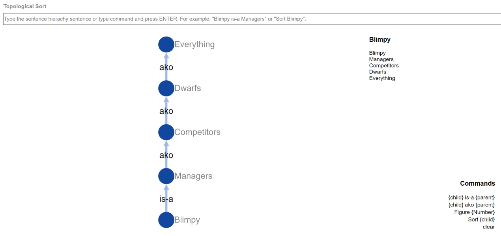
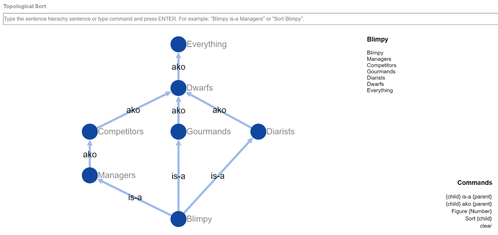
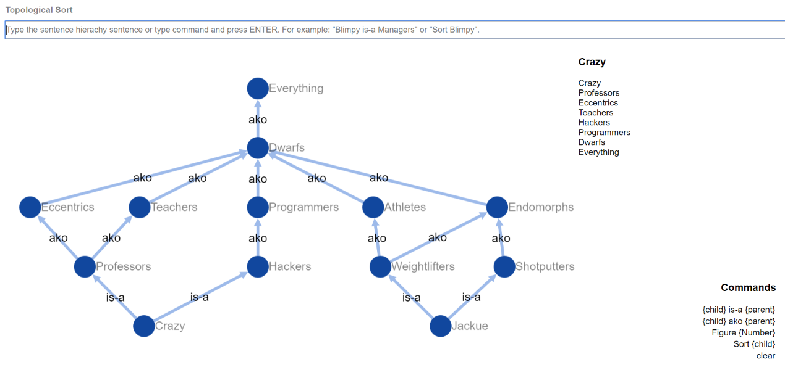
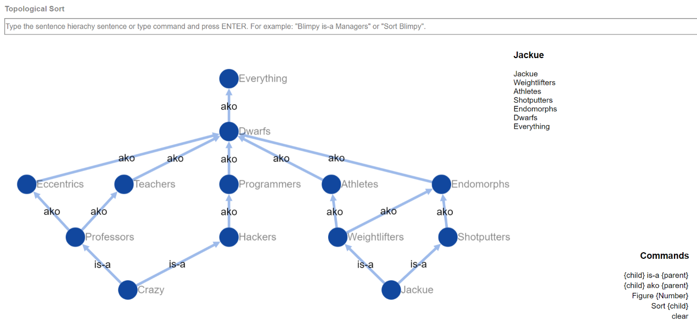
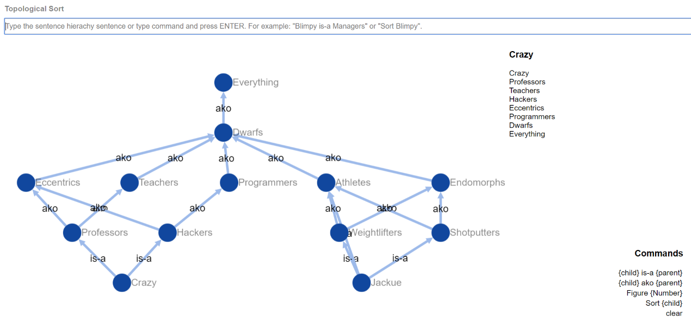
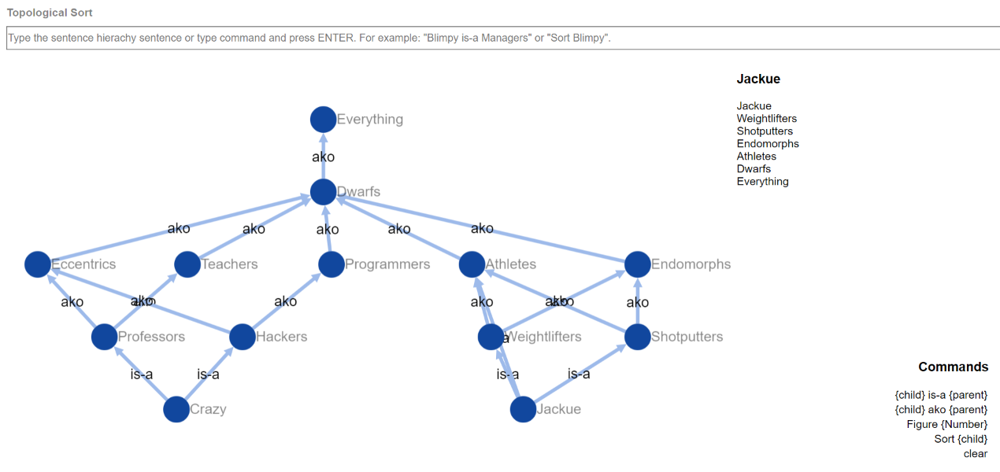

# ai-topological-sort

Read [Assignment](Assignment.pdf).

The objective was the finding class precedence lists using topological sort. The problem was represented by visualizing graphs. Both visualizer & solver are coded in Javascript and HTML. The application has a input box to communicate with end-user. Figures on the next pages contain the visualized graphs on the left and generated class precedence list on the top-right.

### Commands

* **Blimpy is-a/ako Managers:** adds (if not exist) Blimpy and Managers nodes and directed is-a/ako node between them.

* **Figure 9.2/9.4/9.5/9.6:** Generates Figure 9.2/9.4/9.5/9.6.

* **Sort Blimpy:** generates class precedence list for Blimpy.

* **Clear:** clears graph and class precedence list.

### Examples

* `Figure 9.2` -> `Sort Blimpy`

* `Figure 9.4` -> `Sort Blimpy`

* `Figure 9.5` -> `Sort Crazy`

* `Figure 9.5` -> `Sort Jackue`

* `Figure 9.6` -> `Sort Crazy`

* `Figure 9.6` -> `Sort Jackue`

### Used Libraries
* [cytoscape.js](https://github.com/cytoscape/cytoscape.js) (For graph visualization)

* [cytoscape.js-dagre](https://github.com/cytoscape/cytoscape.js-dagre) (For graph layout)

* [jquery](https://github.com/jquery/jquery) (cytoscape.js dependency)
